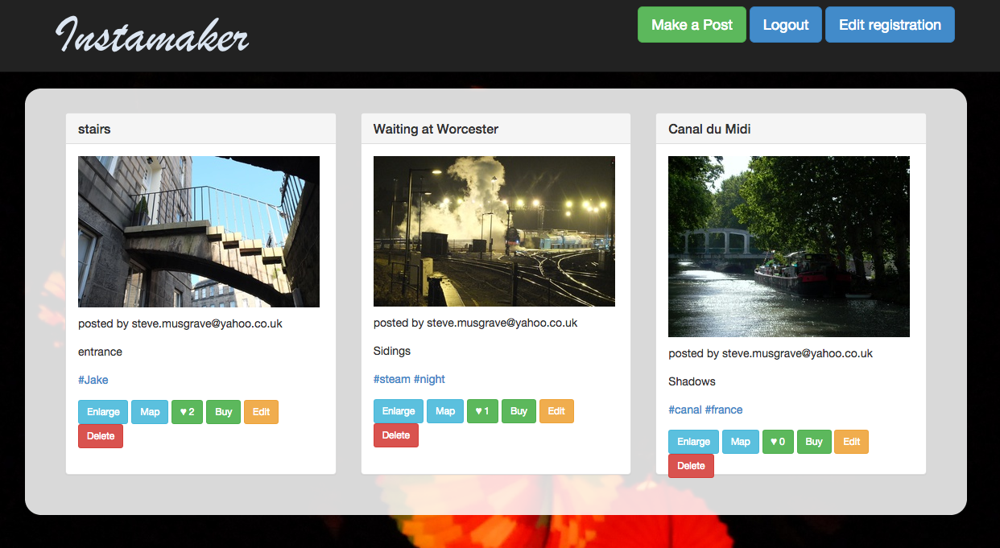

# Instamaker - an Instagram clone
Week 9 project at Makers Academy


## Learning Objectives
Learning to develop a Ruby on Rails app
Setting up the Rails infrastructure 
Understanding the roles of routers, controllers, models and views
Creating one-to-many and many-to-many database relationships between various models: posts, likes, users and tags
Using Paperclip for file attachment
Using Amazon Web Services's storage platform S3 to save images
Using ImageMagick for image optimization
Integrating Bootstrap, a front-end styling theme

## How to run it
```sh
git clone git@github.com:StephanMusgrave
cd instamaker
open index.html
```

Heroku
----
Click here to open the web page on Heroku: [App on Heroku]

## Technologies used

|Technology                 |Used for                        |
|---------------------------|--------------------------------|
|Ruby 2.1.1                 |Main programming language       |
|Javascript                 |Maps/Ajax & jQuery              |
|Ajax                       |Mainly used in the chatroom     |
|JBuilder/JSON              |To pass information between Ruby and JavaScript |
|jQuery                     |Manipulating the DOM for a dynamic experience |
|Ruby on Rails 4.1.1        |Model View Controller Framework |
|Heroku                     |Deployment: [App on Heroku]     |
|Rspec                      |TDD: Unit testing               |
|Capybara                   |simulates how a user would interact with a website|
|Factory Girl               |A library for setting up Ruby objects as test data  |
|Postgrsql                  |SQL Database                    |
|Devise                     |Creating users                  |
|Amazon Web Services        |Bulk image hosting              |
|Paperclip                  |Uploading images                |
|ImageMagick                |A software suite for displaying, converting, and editing raster image files|
|HTML5                      |Web Pages                       |
|CSS3                       |Styling                         |
|Bootstrap                  |Base styling theme              |
|Geolocation/Geomapper      |Showing maps                    |


## Developed by

[Steve Musgrave]

[Steve Musgrave]:https://github.com/StephanMusgrave
[App on Heroku]:http://instamakermusgrave.herokuapp.com/

## Further work to do
- Sort out error with geomapping on Heroku version
- Add commnents
- email notification

